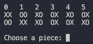

# Blinq

Group: Blinq_1
up202108718 - Pedro da Cunha Teixeira e Faro Beirão (100%)

## Installation and Execution

Download the zip file of the project and extract it.

Consult the main.pl file using Sicstus

```bash
sicstus -l main.pl
``` 

Start the game using the play/0 predicate

```prolog
?- play.
```

## Game Description

Blinq is a 2 player board game where the objective is to connect both side of your color/symbol

You take turns stacking pieces in a pyramid shape until you mange to connect both side or you run out of pieces

To enforce this shape, every piece placed needs to be resting in the middle of 4 different pieces

https://boardgamegeek.com/boardgame/271266/blinq

## Game Logic

### Internal Game State Represeantation

The game state is stored in the following way:
```prolog
[
    CurrentPlayer,  % boolean: false = player O, true = player X
    GameMode,       % integer: 1 = player vs player, 2 = player vs bot, 3 = bot vs bot
    Board,          % list of lists: the board. (constucted each loop by stacking the layers)
    Layer0,         % list of lists: the bottom layer of the board (8x8)
    Layer1,         % list of lists: the second layer of the board (6x6)
    Layer2,         % list of lists: the third layer of the board (4x4)
    Layer3          % list of lists: the top layer of the board (2x2)
]
```

### Game State Visualization

For visualizing the current game state, there is a predicate called display_game(+GameState) that prints the board

For readability and ease of use, this predicate also draws the possible valid moves that the played can make. These are passed to the predicate in the game state as if they were the layers


### Move Validation and Execution

A move consists of 2 things, choosing where to place the piece, and choosing what piece to place

Using the Possible Moves displayed above, the played can select a character that represents the place where the piece will be placed

Then, a menu is shown with the pieces that the player can choose from



After the place and the piece are chosen and validated to be possible, the predicate move(+GameState, +Move, -NewGameState) is called

### List of Valid Moves

For ease of use, we need to show the user the place where he can place the piece as well as keeping a list with the possible moves, for this, the predicate valid_moves(+GameState, -ListOfMoves) is used

The ListOfMoves countains a list of each move available in the layer, so we will need to convert it to a list of moves for the whole board when validating the user input

### End Game

Unfortunately, because of the nature of this game and the way Prolog works, I was not able to finish this feature

### Computer Plays

The computer plays by choosing a random valid move from the list of valid moves and a random piece

Just like the End Game, I was not able to finish the greedy algorithm

## Conclusions

This was a very interesting project to make in a language like Prolog, but it also made it much more difficult than if I was using a Object Oriented language like C++